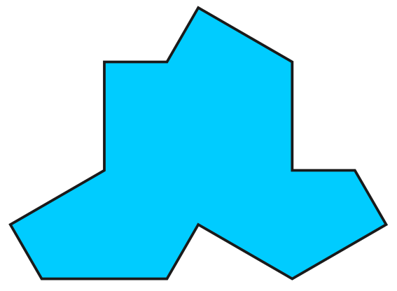
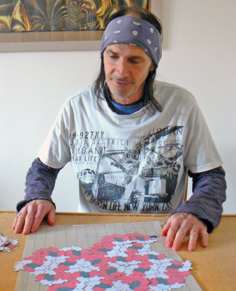
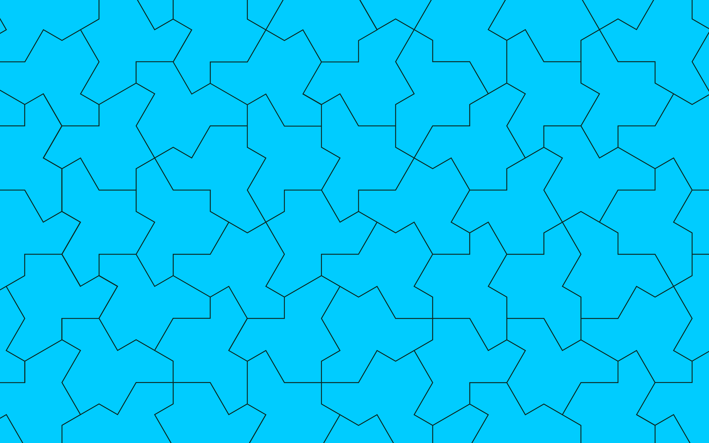
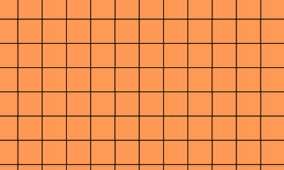
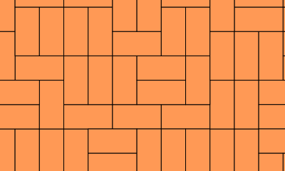
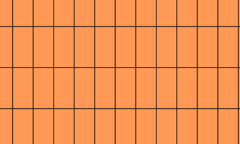
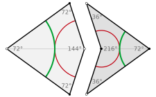
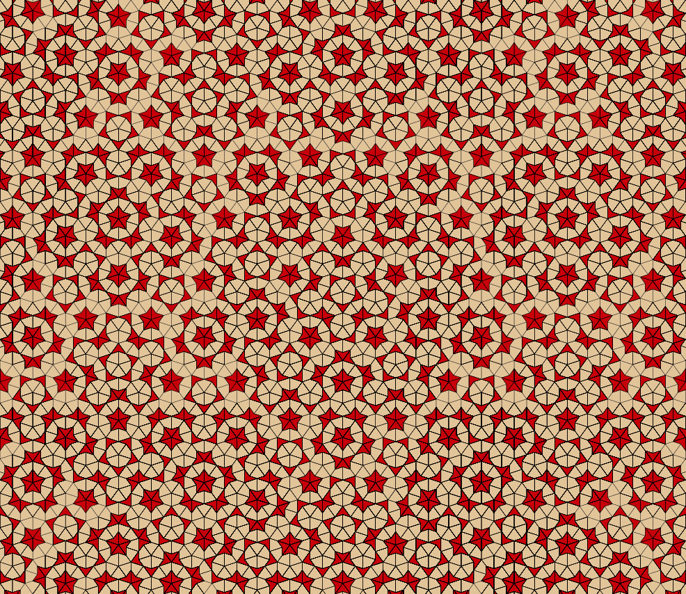
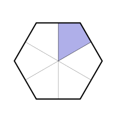
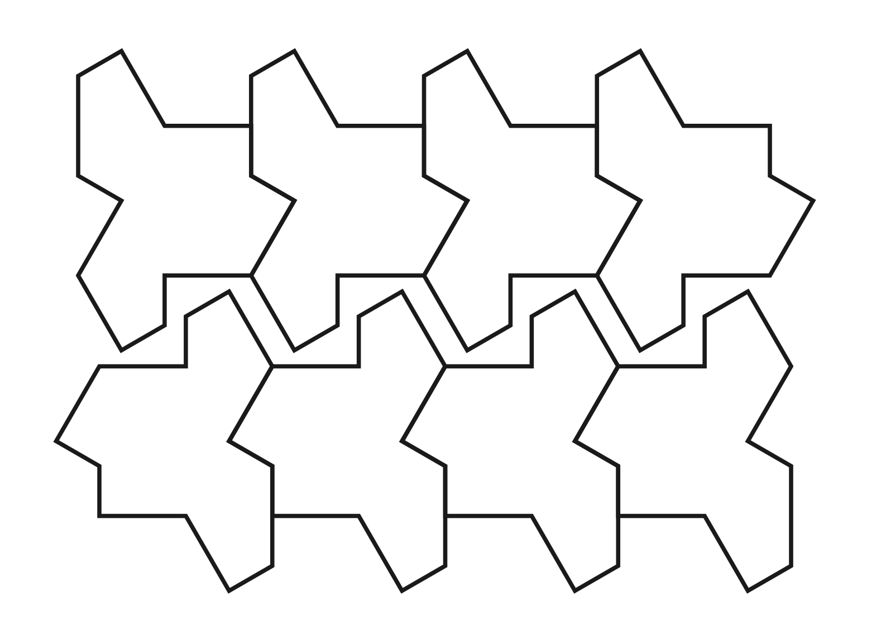

# Story of the Hat Tile

If you're here, chances are that you recently tried building patches of so-called **hat tiles** in a University of Nottingham event. This page will explain more about the amazing discovery of this special tile. At the bottom, you can find some print-outs to try building large patches of tiles at home.

## What is the hat tile, and who found it?

Here is the hat tile:

It looks simple enough, it is a polygon (a shape made of straight sides), with 13 edges. Simple shapes with interesting properties aren't discovered that often, so you might think that it was likely found hundreds, maybe thousands of years ago! But, in fact, it was discovered very recently, around 2022 by David Smith:

The above photo of David is from this excellent [Quanta article](https://www.quantamagazine.org/hobbyist-finds-maths-elusive-einstein-tile-20230404/) on the discovery. David Smith has been variously described as an 'amateur mathematician' or 'hobbyist'. This is no bad thing! Although not *employed* as a mathematician, he is clearly a gifted geometer, and his love of it led him to his discovery. It just goes to show, you don't need to be a professional mathematician to discover an important new shape!

It is called the 'hat' because it looks a bit like a top-hat. I personally think it looks a bit more like a t-shirt, if you turn it around (several others have told me the same)!

## What's special about the hat?

It is true (but hard to show!) that, if you have an unlimited supply of hat tiles, you can use them to cover the whole infinite plane. Think of it as covering the floor, but with the floor going on forever in all directions!

That's not too special, we already know of plenty of shapes of tiles that tile the plane. For example, the standard tessellation of squares, which you might find in your bathroom, can also tile the whole plane: 

The above tiling is **periodic**. This means that you can slide the whole thing over and line it up exactly with the original (and you can do this in two different directions). Another way of thinking about it, is that there's a block which repeats over and over, in the same way, across the whole plane. Once you know the basic building block, and how it repeats, you know how it looks everywhere.

**Can you think of any other tilings like this, based on other shapes?** Hint: ask the bees!

It is also not too hard to find shapes, like a 2-by-1 rectangle, which allow for tilings which are **not** periodic (and are perhaps quite random):

but also permit periodically repeating tilings:

Periodic patterns, since they repeat, are relatively simple for us to understand. Indeed, mathematicians have found all of the possible ones, in some sense (there are 17 possibilities, given by the	 "[wallpaper groups](https://en.wikipedia.org/wiki/Wallpaper_group)").

The hat tile is different. Even though **you can tile the whole plane with hats**, going on forever, the only tilings you can make **never periodically repeat**! This makes them more complicated... and more interesting!

## Discovery of the hat

Before the hat, we already knew that there can be collections of tiles which can tile the plane only non-periodically. The first set was found by Robert Berger. But, instead of being just one tile, it consisted of **20,426** "domino-like" tiles! How on Earth could he have done this? Well, his discovery was based on some interesting mathematics, linking tiling problems to questions in logic, related to how computers work.

The race was on to find much smaller sets of non-periodic tiles!

After some progress on this, around the 1970s, the physicist Roger Penrose brought the number down to just 2. He found a pair (actually, two pairs, but they make similar tilings) of tiles, called the kite and dart tiles, pictured below (image from [Wikipedia](https://en.wikipedia.org/wiki/Penrose_tiling)):

There is a rule that the different coloured markings need to continue over edges (or one can alternatively turn these into bumps and dents to force the same rule). Here is part of an infinite tiling they make (with different colours of tiles):

The above image is from the University of Bielefeld's [Tilings Encyclopedia](https://tilings.math.uni-bielefeld.de/substitution/penrose-kite-dart/). I recommend looking through this website for other images of beautiful aperiodic tilings!

Thus, following Penrose's discovery of a pair of non-periodic tiles, there was a natural question: is there **a single shape** of tile, which can tile the whole plane but only non-periodically? We knew we could do it with two. What about just one?

Fifty or so years on, David Smith was experimenting with shapes called 'polykites'. These are formed by putting together particular shapes, called kites, which you get by cutting a regular hexagon by lines through the centres of its edges, as in the image below:

One (of six) of these kites has been shaded.

**Challenge:** Try printing the above twice and cutting out the kites. See if you can arrange eight of them together to build the hat tile at the top of this page!

At some point, David found a shape (the hat!) that he seemed to be able to keep tiling further and further with. This sometimes happened for other shapes: you might find a 'block' which can then be repeated forever, making periodic tilings. But this one was different. It seemed to keep tiling, but never in a periodic way.

How do we actually **prove** the shape tiles forever, and only non-periodically? That needs some Maths! You can look at the mathematical research paper proving that [here](https://arxiv.org/pdf/2303.10798), although even for professional mathematicians this is not easy to follow! (but there are some nice pictures in it you might be interested to see). David needed some help with this, and first recruited Craig Kaplan, a Canadian mathematician and computer scientist, who had experience in coding these kinds of tessellation problems.

Craig set a deadline of Christmas that year to try to find the proofs, but was unable to. So they brought on another world-renowed expert to help, Chaim Goodman-Strauss, an American mathematician specialising in geometry. The group quickly also recruited Joseph Samuel Myers, from the UK, to help. Although not a working mathematician, Joseph got a degree in Mathematics from Cambridge, helps with Maths Olympiad activities and also had a lot of experience in these geometry problems.

Several months later, in March 2023, they announced their result and put their research paper online for everyone to read. The paper introduced the hat, and explained a proof of why it can tile forever, but only non-periodically, neither being easy to show!

As you'll find out when trying to make tilings with the hat **you sometimes need to flip the tile over**. Perhaps you think this is cheating. If so, fear not! The same team who found the hat later found another tile, called the **spectre tile**, which can also tile the whole plane, only non-periodically, and you only need to use the tile one way up! Here is a picture of a tiling of the spectre (ignore the different shades and light lines near the edges, all tiles are the same and can still be made as polygons we can cut out!), this image from [MoMath](https://momath.org/the-hat/):

## A new area of Mathematics

Mathematicians and physicists are interested in these "aperiodically ordered" structures as a new area of research! In Maths, lots of structures we've seen before turn out to be linked to these patterns. In Physics, tilings can be interesting models of how structures repeat in real materials.

Take diamond, for instance. As you probably know, this is an extremly stong material. Part of the reason is its atoms are arranged and linked in a periodically repeating way, using the following fundamental 'building block':

Animation from [Wikipedia](https://en.wikipedia.org/wiki/Diamond_cubic). Much like how two-dimensional shapes can be used to cover the plane, tiny versions of the above can be put together in three-dimensional space, and this is the structure of diamond. Generally, beautiful crystals have this kind of structure (but with other symmetries).

Scientists can try to work out the structures and symmetries of these objects by shining X-rays at them and looking at the patterns this makes on a screen. In the 1980s, crystallographer Dan Shechtman found the following image from this kind of experiment:

Notice that there is a beautiful pattern of spots. Therefore, the material he was testing **must be highly organised**! On the other hand, it turns out to have 'forbidden symmetries' so **could not be based on a periodically repeating pattern**! Therefore, he had shown that ordered but non-periodic patterns, like 3d versions of the hat (or, then, Penrose) tiles, can be made. The scientific community was initially very sceptical (and in some cases, rudely critical) of his work. However, we now know more, that these really are a new kind of aperiodically ordered material, and he was vindicated by winning the Nobel Prize (one of the most important in science), in Chemistry, in 2011.

We are still exploring what applications these materials might have. Perhaps interesting and useful materials can be made from these so-called 'quasi-crystals'. And mathematicians study such structures in a new area of research, called **Aperiodic Order**.

## Tiling forever and a challenge for at home

You can think of the hat as like a jigsaw piece, just for one of the world's hardest jigsaws (and one that goes on forever, with only one shape of piece!). However, the tilings it can make, whilst never periodically repeating, still have a lot of interesting structure. They're not totally random!

**Challenge, Step 1:** Try print a few sheets of the following hat tiles, and carefully cut them out. If you click on the image, you can get a pdf file if that's easier for you:

**Step 2:** Print the (two-sided) pdf [at this link](../../hat_pics/H7_and_H8_hat_templates.pdf).

Each side has a template for a 'cluster' or 'patch' of tiles, one with 7 tiles and one with 8. 

**Step 3:** Try covering the template regions precisely with hat tiles. When you do, tape them together for later! Make quite a lot of the 8-tile clusters (around 16 or so, to start with) and just a couple of the 7-tile clusters, those are much rarer.

**Step 4:** Now try to put these clusters together!

In Step 3, you found that the tiles groups into these clusters. In Step 4, you might see that these clusters can form bigger 'super-clusters'. These super-clusters can be built, and together group into super-super-clusters too, and so on, this keeps going forever, with similar building instructions between each level! All possible hat tilings have this kind of 'hierarchy'.

A hint of how this might work can be seen in Figure 2.11 (page 19) of the newest version of the discovers' paper [here](https://arxiv.org/pdf/2303.10798). Trying to make this precise is hard, but it is one way of showing the tile can tile forever and only non-periodically.

Lots of other interesting non-periodic tile sets, like the Penrose tiles earlier, also have this hierarchical structure! And there will certainly be many interesting, new versions we discover in the future too, a whole world of fascinating patterns is there to be explored.

